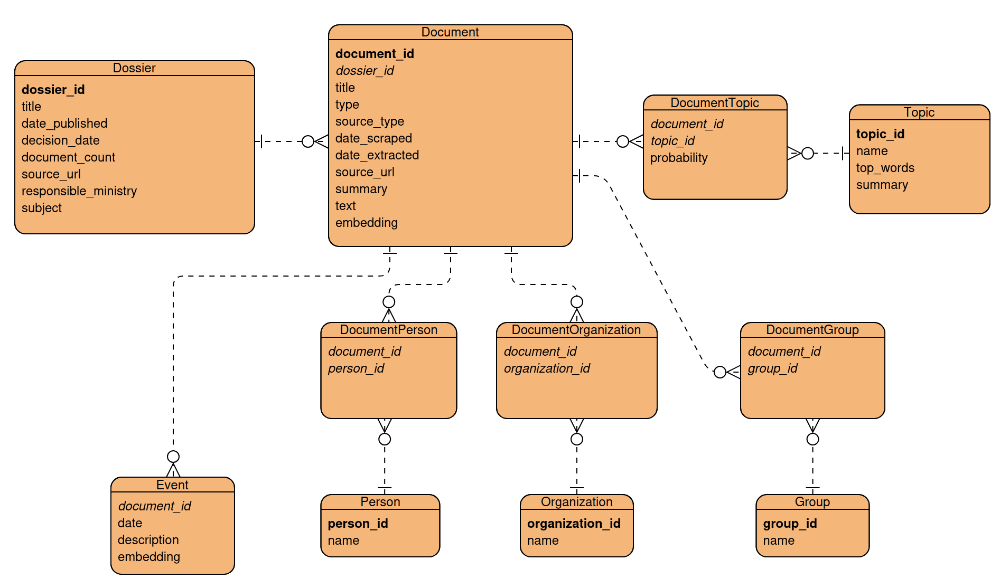

# Proof of Concept Archief Tijdlijnen

Een Proof of Concept project om documenten, dossiers en metadata uit een Woo-dataset te ontsluiten via een GraphQL API met PostgreSQL als databron. 

- **Databron**: de database is gevuld met 23.000 Woo-stukken van het Ministerie van Volksgezondheid, Welzijn en Sport met betrekking tot **COVID-19**. De documenten zijn gescraped van de website [Open Min VWS](https://open.minvws.nl/thema/covid-19). Het gaat om documenten van grofweg de eerste 9 maanden van de coronacrisis. 
- **Preprocessing** van de data bestond uit:
  1. Optical Character Recognition (OCR) om de tekst uit de PDF-bestanden te halen.
  2. Metadata extractie (d.m.v. Gemini)
      - Datums
      - Personen
      - Ministeries/organisaties/instituten
      - Bevolkingsgroepen
      - Samenvatting van documenten
      - Gebeurtenissen met bijbehorende datums
- **Topic Modeling (BERTopic)**: hiermee zijn grotere thema's uit de dataset geclusterd om gerichter zoeken te faciliteren. 

---

## Stack
- **PostgreSQL** — relationele database
  - Embeddings van de samenvattingen en gebeurtenissen zijn opgeslagen middels [pgvector](https://github.com/pgvector/pgvector) om vector search mogelijk te maken
- **Node.js + TypeScript** — backend
- **Apollo Server v4** — GraphQL API
- **Docker Compose** — om alles samen te draaien
- **Next.js + React + Apollo Client** — frontend

---

## Lokaal opstarten 

Deze repository bevat het grote databasebestand niet i.v.m. GitHub-beperkingen. Voer de volgende stappen uit na het clonen van de repository om de database gereed te maken.

**1. Download handmatig de init file en plaats in project**
   - [`init.sql.template`](https://drive.google.com/file/d/1Xh6dIE0h16BUzQDdM-v8eo-_M_m6uTbw/view?usp=sharing)

Plaats het bestand in de directory `init`

`init/init.sql.template`

**2. `.env` file aanmaken**

Kopieer `.env.example` naar `.env` met
```bash 
cp .env.example .env
```
Vul vervolgens de missende velden in. Het wachtwoord van de beheerder kan aangevraagd worden (stuur een mail naar `nena.github@outlook.com`).

**3. Docker**

Vereisten

- [Docker](https://www.docker.com/products/docker-desktop/)
- [Docker Compose](https://docs.docker.com/compose/install/)

Start de Docker containers vervolens op met het command in de root van het project

```bash
docker-compose up --build
```
De PostgreSQL database zal automatisch worden opgebouwd met het script uit `init/init.sql.template`

Vervolgens is de UI beschikbaar op: `http://localhost:3000/`

---
## Testen van de GraphQL API

De API is beschikbaar op: `http://localhost:4000/graphql`

> Let op: dit endpoint accepteert alleen `POST`-requests. Gebruik bijvoorbeeld Postman of Insomnia.

Er is een [Postman collectie](https://speeding-crater-347082.postman.co/workspace/My-Workspace~516996a4-6fa7-485b-804f-0a7dba594bcf/collection/30911572-2066d047-230b-4aa2-b4d5-5fe843c9219b?action=share&creator=30911572) beschikbaar om de queries te testen.

---

## Entity Relation Diagram



---
## Known impedements & future improvements

- Dataset uitbreiden, entity extraction
- Performance
- Hosting